---

## 片名

**華安 · huaan9426**

我把这里当作一张片头字幕：不堆资源，不追热闹，只留下能被公开审阅的东西。  
代码是器物，自动化是场面调度，AI Coding 是剪辑台上的第二双手。

## 长镜头

当前公开主线：[walle-ai-trash](https://github.com/huaan9426/walle-ai-trash)

它处理 AI 编码之后遗留的临时项目、草稿目录和无主文件。  
我更在意它是否**稳、准、可撤回**，而不是看上去有多复杂。

## 灯光表

| 镜头 | 方法 |
| --- | --- |
| 工具 | 小而清楚，先能解决真实问题 |
| 自动化 | 只接管重复劳动，不制造额外负担 |
| 清理 | 默认保守，能预览，能回滚 |
| 公开主页 | 像片头，不像广告牌 |

## 场记

- 311 contributions in the last year
- 贡献明细保留给 GitHub 页面底部的原生贡献区，不在 README 中重复造图
- 私有实验、未完成草稿和临时学习仓库不会放在这里

## 尾声

光在可读处停留，工具在可回溯处成形。  
我偏向把复杂度藏在实现里，把判断留在界面上。
